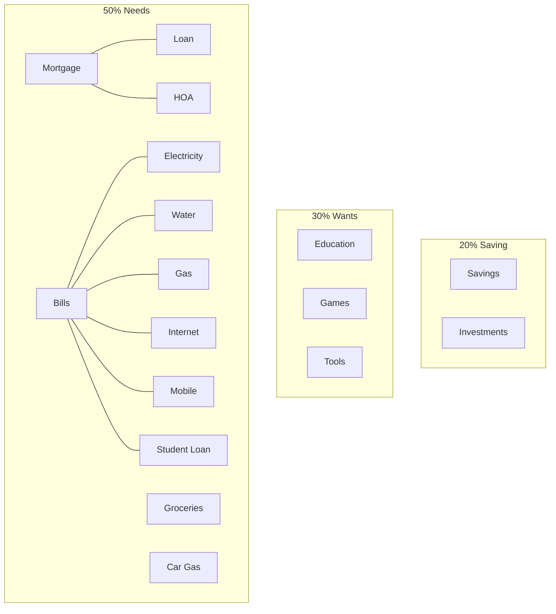

```mermaid
graph TD;
	subgraph "20% Saving"
		C1[Savings]
		C2[Investments]
	end
	
	subgraph "30% Wants"
		B1[Education]
		B2[Games]
		B3[Tools]
	end
	
	subgraph "50% Needs"
		A1[Mortgage]
		A2[Bills]
		A3[Groceries]
		A4[Car Gas]
		
		A1---A11[Loan]
		A1---A12[HOA]
		
		A2---A21[Electricity]
		A2---A22[Water]
		A2---A23[Gas]
		A2---A24[Internet]
		A2---A25[Mobile]
		A2---A26[Student Loan]
	end
```