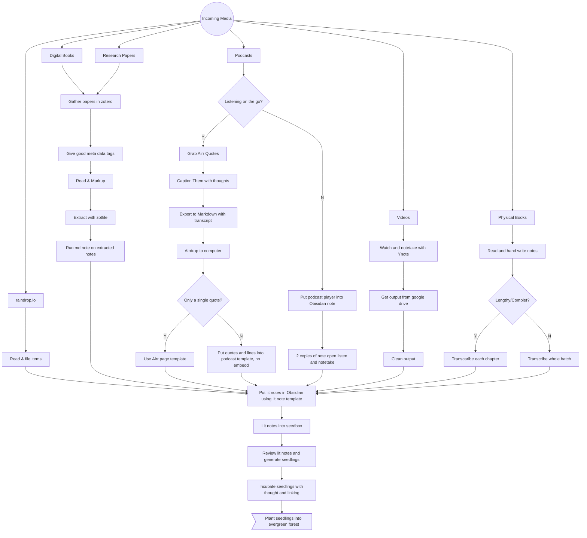

```mermaid
graph TD;
	A((Incoming Media))-->B[raindrop.io]
	B-->C[Read & file items]
	C-->D[Put lit notes in Obsidian using lit note template]
	A-->E[Digital Books]
	A-->F[Research Papers]
	E-->G[Gather papers in zotero]
	F-->G
	G-->H[Give good meta data tags]
	H-->I[Read & Markup]
	I-->J[Extract with zotfile]
	J-->K[Run md note on extracted notes]
	K-->D
	A-->L[Podcasts]
	L-->M{Listening on the go?}
	M-->|Y|N[Grab Airr Quotes]
	N-->N2[Caption Them with thoughts]
	N2-->N3[Export to Markdown with transcript]
	N3-->N4[Airdrop to computer]
	N4-->N5{Only a single quote?}
	N5-->|Y|N6[Use Airr page template]
	N5-->|N|N7[Put quotes and lines into podcast template, no embedd]
	N6-->D
	N7-->D
	M-->|N|O[Put podcast player into Obisidan note]
	O-->O2[2 copies of note open listen and notetake]
	O2-->D
	A-->P[Videos]
	P-->P2[Watch and notetake with Ynote]
	P2-->P3[Get output from google drive]
	P3-->P4[Clean output]
	P4-->D
	A-->Q[Physical Books]
	Q-->Q2[Read and hand write notes]
	Q2-->Q3{Lengthy/Complet?}
	Q3-->|Y|Q4[Transcaribe each chapter]
	Q3-->|N|Q5[Transcribe whole batch]
	Q4-->D
	Q5-->D
	D-->R[Lit notes into seedbox]
	R-->R2[Review lit notes and generate seedlings]
	R2-->R3[Incubate seedlings with thought and linking]
	R3-->R4>Plant seedlings into evergreen forest]
```