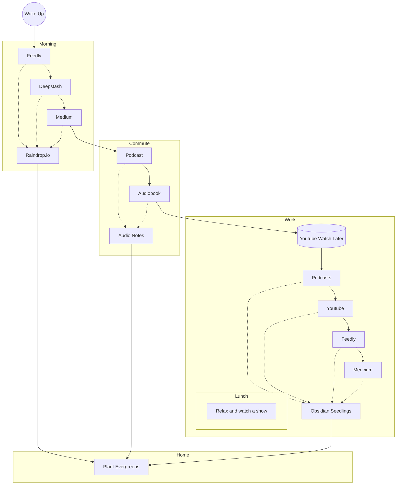

```mermaid
graph TD;
	A((Wake Up))-->M1[Feedly]
	subgraph "Morning"
		M1-.->MM
		M1-->M2[Deepstash]-.->MM
		M2-->M3[Medium]-.->MM
		MM[Raindrop.io]
		class M1 internal-link;
		class M2 internal-link;
		class M3 internal-link;
	end
	
	subgraph "Commute"
		M3-->C1
		C1-.->CC
		C1[Podcast]-->C2[Audiobook]-.->CC
		CC[Audio Notes]
	end
	
	subgraph "Work"
		C2-->W1[(Youtube Watch Later)]
		W1-->W2[Podcasts]-.->WW[Obsidian Seedlings]
		W2-->W3[Youtube]-.->WW
		W3-->W4[Feedly]-.->WW
		W4-->W5[Medcium]-.->WW
		subgraph "Lunch"
			WL[Relax and watch a show]
		end
	end
	
	subgraph "Home"
		HH[Plant Evergreens]
		MM-->HH
		CC-->HH
		WW-->HH
		class HH internal-link;
	end
```